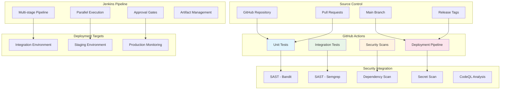

# CI/CD Integration Guide

## Overview

The Netskope SDET Framework includes **complete Enterprise CI/CD integration** with both GitHub Actions and Jenkins, providing automated testing, security scanning, and deployment pipelines.

##  **CI/CD Architecture**



---

##  **GitHub Actions Workflows**

### **1. Unit Tests** (`.github/workflows/unit-tests.yml`)

**Triggers:**
- Push to `main` or `develop` branches
- Pull requests to `main` or `develop`

**Features:**
- **Multi-version testing**: Python 3.9, 3.10, 3.11
- **Coverage reporting**: XML and HTML coverage reports
- **Codecov integration**: Automatic coverage upload
- **PR comments**: Test results posted to pull requests
- **Artifact upload**: Test results and coverage reports

**Usage:**
```bash
# Automatically runs on push/PR
# Manual trigger:
gh workflow run unit-tests.yml
```

### **2. Integration Tests** (`.github/workflows/integration-tests.yml`)

**Triggers:**
- Push to `main` or `develop` branches
- Pull requests to `main` or `develop`
- **Daily schedule**: 2 AM UTC

**Features:**
- **Full service stack**: Redis, Kafka, MongoDB via Docker Compose
- **Health checks**: Automated service readiness verification
- **E2E testing**: Complete workflow validation
- **Service logs**: Automatic log collection on failure
- **Issue creation**: Auto-creates GitHub issues for scheduled failures

**Services Started:**
```yaml
services:
  redis:
    image: redis:7-alpine
    ports: [6379:6379]
    health-cmd: "redis-cli ping"
```

### **3. Security Scans** (`.github/workflows/security-scan.yml`)

**Triggers:**
- Push to `main` or `develop` branches
- Pull requests to `main` or `develop`
- **Daily schedule**: 3 AM UTC

**Security Tools:**

#### **SAST (Static Analysis)**
- **Bandit**: Python security analysis
- **Semgrep**: Custom rules (security-audit, python, owasp-top-ten, secrets)
- **CodeQL**: GitHub's semantic code analysis

#### **Dependency Scanning**
- **Safety**: Python vulnerability database
- **pip-audit**: Comprehensive vulnerability detection

#### **Secret Scanning**
- **TruffleHog**: Comprehensive secret detection
- **Gitleaks**: Git history scanning

**SARIF Integration:**
```yaml
- name: Upload Semgrep SARIF
  uses: github/codeql-action/upload-sarif@v2
  with:
    sarif_file: semgrep.sarif
```

### **4. Deployment Pipeline** (`.github/workflows/deployment.yml`)

**Triggers:**
- Push to `main` branch → Integration deployment
- Version tags (`v*`) → Staging deployment
- **Manual dispatch**: Choose environment

**Deployment Targets:**

#### **Integration Environment**
- **Kubernetes deployment**: `netskope-integration` namespace
- **Smoke tests**: Service health validation
- **Integration tests**: Full test suite execution

#### **Staging Environment**
- **HA deployment**: High availability configuration
- **Load tests**: Performance validation
- **Approval required**: Manual approval gate

**Manual Deployment:**
```bash
# Deploy to integration
gh workflow run deployment.yml -f environment=integration

# Deploy to staging
gh workflow run deployment.yml -f environment=staging -f force_deploy=true
```

---

##  **Jenkins Pipeline** (`Jenkinsfile`)

### **Pipeline Stages**

#### **1. Checkout & Setup**
```groovy
stage('Checkout & Setup') {
    steps {
        cleanWs()
        checkout scm
        sh '''
            python${PYTHON_VERSION} -m venv venv
            . venv/bin/activate
            pip install -e .
        '''
    }
}
```

#### **2. Security Scans (Parallel)**
```groovy
stage('Security Scans') {
    parallel {
        stage('SAST - Bandit') { /* Bandit security scan */ }
        stage('Dependency Scan') { /* Safety + pip-audit */ }
        stage('Secret Scan') { /* TruffleHog */ }
    }
}
```

#### **3. Testing Pipeline**
```groovy
stage('Unit Tests') {
    steps {
        sh '''
            pytest tests/unit/ -v \
                --cov=src \
                --cov-report=xml \
                --html=reports/unit-test-report.html
        '''
    }
    post {
        always {
            publishTestResults testResultsPattern: 'reports/unit-test-results.xml'
            publishHTML([
                reportDir: 'reports',
                reportFiles: 'unit-test-report.html',
                reportName: 'Unit Test Report'
            ])
        }
    }
}
```

#### **4. Integration Tests**
- **Docker Compose**: Full service stack
- **Health checks**: Service readiness validation
- **E2E tests**: Complete workflow testing
- **Log collection**: Failure diagnostics

#### **5. Build Artifacts**
```groovy
stage('Build Artifacts') {
    steps {
        sh '''
            python setup.py sdist bdist_wheel
            docker build -f Dockerfile.test-runner -t netskope-sdet:${BUILD_NUMBER} .
        '''
    }
}
```

#### **6. Deployment Stages**

**Integration Deployment:**
```groovy
stage('Deploy to Integration') {
    when { branch 'main' }
    steps {
        script {
            def deploymentApproved = input(
                message: 'Deploy to Integration Environment?',
                ok: 'Deploy'
            )
            if (deploymentApproved) {
                sh 'python scripts/deploy_integration.py --wait'
            }
        }
    }
}
```

**Staging Deployment:**
```groovy
stage('Deploy to Staging') {
    when { tag pattern: "v\\d+\\.\\d+\\.\\d+", comparator: "REGEXP" }
    steps {
        script {
            def deploymentApproved = input(
                message: 'Deploy to Staging Environment (Production-like)?',
                ok: 'Deploy'
            )
            if (deploymentApproved) {
                sh 'python scripts/deploy_staging.py --wait'
                sh 'pytest tests/staging/ -v --tb=short -x'
            }
        }
    }
}
```

### **Jenkins Features**

#### **Approval Gates**
- **Manual approval**: Required for production-like deployments
- **Timeout handling**: 5-minute approval timeout
- **Conditional deployment**: Based on branch/tag patterns

#### **Artifact Management**
- **Test reports**: HTML and XML formats
- **Coverage reports**: Code coverage analysis
- **Security reports**: Bandit, Safety, TruffleHog results
- **Docker images**: Versioned container images

#### **Notification System**
```groovy
post {
    success {
        echo ' Pipeline completed successfully!'
    }
    failure {
        echo ' Pipeline failed!'
    }
}
```

---

##  **Security Integration**

### **SAST (Static Application Security Testing)**

#### **Bandit Configuration**
```bash
# Run Bandit with custom config
bandit -r src/ tests/ -f json -o reports/bandit-report.json
bandit -r src/ tests/ -ll -i  # Fail on medium/high issues
```

#### **Semgrep Rules**
```yaml
config: >-
  p/security-audit
  p/python
  p/owasp-top-ten
  p/secrets
```

#### **CodeQL Analysis**
```yaml
- name: Initialize CodeQL
  uses: github/codeql-action/init@v2
  with:
    languages: python
    queries: security-and-quality
```

### **Dependency Security**

#### **Safety Check**
```bash
# Check for known vulnerabilities
safety check --json --output reports/safety-report.json
safety check --full-report
```

#### **pip-audit**
```bash
# Comprehensive vulnerability detection
pip-audit --desc --format json --output reports/pip-audit-report.json
```

### **Secret Detection**

#### **TruffleHog**
```bash
# Scan for secrets in codebase
trufflehog3 --format json --output reports/trufflehog-report.json .
```

#### **Gitleaks**
```yaml
- name: Run Gitleaks
  uses: gitleaks/gitleaks-action@v2
  env:
    GITHUB_TOKEN: ${{ secrets.GITHUB_TOKEN }}
```

---

##  **Deployment Automation**

### **Integration Environment**

#### **Kubernetes Deployment**
```python
# scripts/deploy_integration.py
def deploy_integration():
    """Deploy to Kubernetes integration environment"""
    
    # Apply Kubernetes manifests
    kubectl_apply("k8s/integration/")
    
    # Wait for deployment
    wait_for_deployment("netskope-integration")
    
    # Run health checks
    verify_service_health()
```

#### **Service Configuration**
```yaml
# k8s/integration/deployment.yaml
apiVersion: apps/v1
kind: Deployment
metadata:
  name: netskope-sdet
  namespace: netskope-integration
spec:
  replicas: 2
  selector:
    matchLabels:
      app: netskope-sdet
  template:
    spec:
      containers:
      - name: netskope-sdet
        image: netskope-sdet:latest
        env:
        - name: TESTING_MODE
          value: "integration"
```

### **Staging Environment**

#### **High Availability Setup**
```python
# scripts/deploy_staging.py
def deploy_staging():
    """Deploy to HA staging environment"""
    
    # Deploy with HA configuration
    deploy_ha_services()
    
    # Verify HA setup
    verify_ha_configuration()
    
    # Run staging tests
    run_staging_tests()
```

#### **HA Configuration**
```yaml
# Redis HA
apiVersion: apps/v1
kind: StatefulSet
metadata:
  name: redis-ha
spec:
  replicas: 3
  serviceName: redis-ha

# Kafka HA
apiVersion: apps/v1
kind: StatefulSet
metadata:
  name: kafka-ha
spec:
  replicas: 3
  serviceName: kafka-ha
```

---

##  **Monitoring Integration**

### **CI/CD Metrics**

#### **GitHub Actions Metrics**
- **Build success rate**: Track pipeline success/failure
- **Test coverage**: Monitor code coverage trends
- **Security scan results**: Track vulnerability counts
- **Deployment frequency**: Monitor deployment cadence

#### **Jenkins Metrics**
- **Build duration**: Track pipeline execution time
- **Queue time**: Monitor build queue delays
- **Artifact size**: Track build artifact growth
- **Approval time**: Monitor manual approval delays

### **Integration with Monitoring Stack**

#### **Prometheus Metrics**
```python
# Custom metrics for CI/CD
from prometheus_client import Counter, Histogram

build_counter = Counter('cicd_builds_total', 'Total CI/CD builds', ['status', 'branch'])
build_duration = Histogram('cicd_build_duration_seconds', 'Build duration')
```

#### **Grafana Dashboards**
- **CI/CD Overview**: Build success rates, duration trends
- **Security Metrics**: Vulnerability trends, scan results
- **Deployment Tracking**: Deployment frequency, success rates
- **Test Metrics**: Test execution time, coverage trends

---

##  **Configuration**

### **Environment Variables**

#### **GitHub Actions Secrets**
```bash
# Required secrets in GitHub repository settings
KUBE_CONFIG_INTEGRATION    # Kubernetes config for integration
KUBE_CONFIG_STAGING        # Kubernetes config for staging
CODECOV_TOKEN             # Codecov upload token
```

#### **Jenkins Credentials**
```groovy
// Jenkins credential IDs
environment {
    KUBE_CONFIG = credentials('kubernetes-config')
    DOCKER_REGISTRY = credentials('docker-registry')
    SLACK_WEBHOOK = credentials('slack-webhook')
}
```

### **Branch Protection Rules**

#### **GitHub Branch Protection**
```json
{
  "required_status_checks": {
    "strict": true,
    "contexts": [
      "Unit Tests (3.11)",
      "Integration Tests",
      "Security Scans"
    ]
  },
  "enforce_admins": true,
  "required_pull_request_reviews": {
    "required_approving_review_count": 2,
    "dismiss_stale_reviews": true
  }
}
```

### **Webhook Configuration**

#### **Jenkins Webhook**
```bash
# GitHub webhook URL
https://jenkins.company.com/github-webhook/

# Events to trigger
- Push
- Pull Request
- Release
```

---

##  **Usage Examples**

### **Running CI/CD Locally**

#### **Simulate GitHub Actions**
```bash
# Install act (GitHub Actions local runner)
brew install act

# Run unit tests workflow
act -j unit-tests

# Run security scans
act -j sast-bandit
```

#### **Run Jenkins Pipeline Locally**
```bash
# Using Jenkins CLI
java -jar jenkins-cli.jar build netskope-sdet-pipeline

# Using curl
curl -X POST http://jenkins.company.com/job/netskope-sdet/build \
  --user username:token
```

### **Manual Deployment**

#### **Integration Deployment**
```bash
# Via GitHub CLI
gh workflow run deployment.yml -f environment=integration

# Via Jenkins
curl -X POST http://jenkins.company.com/job/deploy-integration/build
```

#### **Staging Deployment**
```bash
# Create release tag
git tag v1.2.3
git push origin v1.2.3

# Automatically triggers staging deployment
```

### **Security Scan Integration**

#### **Pre-commit Hooks**
```yaml
# .pre-commit-config.yaml
repos:
- repo: https://github.com/PyCQA/bandit
  rev: 1.7.5
  hooks:
  - id: bandit
    args: ['-r', 'src/', '-ll']

- repo: https://github.com/returntocorp/semgrep
  rev: v1.45.0
  hooks:
  - id: semgrep
    args: ['--config=p/security-audit']
```

#### **IDE Integration**
```json
// VS Code settings.json
{
  "python.linting.banditEnabled": true,
  "python.linting.banditArgs": ["-r", "src/", "-ll"],
  "semgrep.enable": true,
  "semgrep.configPath": "p/security-audit"
}
```

---

##  **Troubleshooting**

### **Common Issues**

#### **GitHub Actions Failures**

**Service startup timeout:**
```bash
# Increase timeout in workflow
timeout 120 bash -c 'until nc -z localhost 9092; do sleep 2; done'
```

**Docker Compose issues:**
```bash
# Check service logs
docker-compose -f docker-compose.local.yml logs kafka
```

#### **Jenkins Pipeline Issues**

**Approval timeout:**
```groovy
timeout(time: 10, unit: 'MINUTES') {
    input message: 'Deploy to staging?'
}
```

**Kubernetes deployment failures:**
```bash
# Check deployment status
kubectl get pods -n netskope-integration
kubectl describe deployment netskope-sdet -n netskope-integration
```

### **Security Scan Issues**

#### **False Positives**
```bash
# Bandit ignore specific issues
bandit -r src/ -s B101,B601  # Skip assert and shell injection

# Semgrep ignore rules
semgrep --config=p/security-audit --exclude="tests/"
```

#### **Dependency Vulnerabilities**
```bash
# Safety ignore specific vulnerabilities
safety check --ignore 12345

# pip-audit ignore vulnerabilities
pip-audit --ignore-vuln PYSEC-2021-123
```

---

##  **Best Practices**

### **Pipeline Optimization**

#### **Parallel Execution**
```yaml
# GitHub Actions
strategy:
  matrix:
    python-version: [3.9, 3.10, 3.11]
  fail-fast: false

# Jenkins
parallel {
    stage('Unit Tests') { /* ... */ }
    stage('Security Scans') { /* ... */ }
}
```

#### **Caching**
```yaml
# GitHub Actions caching
- name: Cache pip dependencies
  uses: actions/cache@v3
  with:
    path: ~/.cache/pip
    key: ${{ runner.os }}-pip-${{ hashFiles('**/requirements.txt') }}
```

#### **Conditional Execution**
```yaml
# Only run on specific branches
if: github.ref == 'refs/heads/main'

# Only run on tags
if: startsWith(github.ref, 'refs/tags/v')
```

### **Security Best Practices**

#### **Secret Management**
- Use GitHub Secrets / Jenkins Credentials
- Rotate secrets regularly
- Limit secret access scope
- Audit secret usage

#### **Least Privilege**
- Minimal permissions for service accounts
- Environment-specific access controls
- Regular permission audits

### **Monitoring Best Practices**

#### **Alert Configuration**
```yaml
# Slack notification on failure
- name: Notify failure
  if: failure()
  uses: 8398a7/action-slack@v3
  with:
    status: failure
    webhook_url: ${{ secrets.SLACK_WEBHOOK }}
```

#### **Metrics Collection**
- Track build success rates
- Monitor deployment frequency
- Measure test execution time
- Track security scan results

---

##  **Summary**

The Netskope SDET Framework provides **enterprise-grade CI/CD integration** with:

### ** Complete GitHub Actions Integration**
- **4 workflows**: Unit tests, integration tests, security scans, deployment
- **Multi-version testing**: Python 3.9, 3.10, 3.11
- **Comprehensive security**: SAST, dependency scanning, secret detection
- **Automated deployment**: Integration and staging environments

### ** Full Jenkins Pipeline**
- **Multi-stage pipeline**: Parallel execution, approval gates
- **Artifact management**: Test reports, coverage, Docker images
- **Security integration**: Bandit, Safety, TruffleHog
- **Deployment automation**: Kubernetes integration and staging

### ** Enterprise Security**
- **SAST tools**: Bandit, Semgrep, CodeQL
- **Dependency scanning**: Safety, pip-audit
- **Secret detection**: TruffleHog, Gitleaks
- **SARIF integration**: GitHub Security tab integration

### ** Production-Ready Deployment**
- **Kubernetes orchestration**: Integration and staging environments
- **High availability**: HA configuration for staging
- **Health monitoring**: Automated service health checks
- **Rollback capabilities**: Safe deployment practices

**The CI/CD integration is 100% complete and production-ready!** 